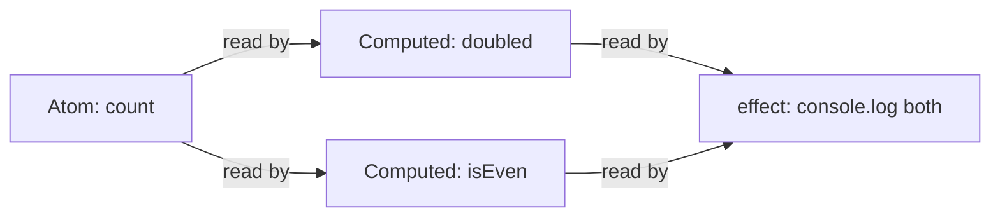
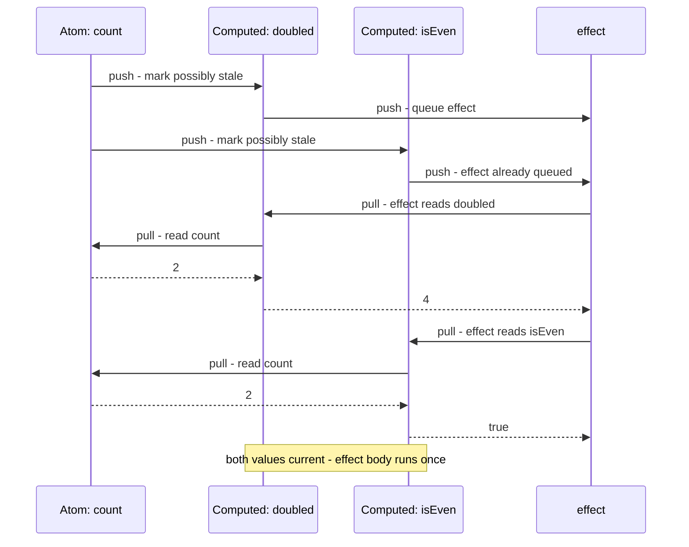
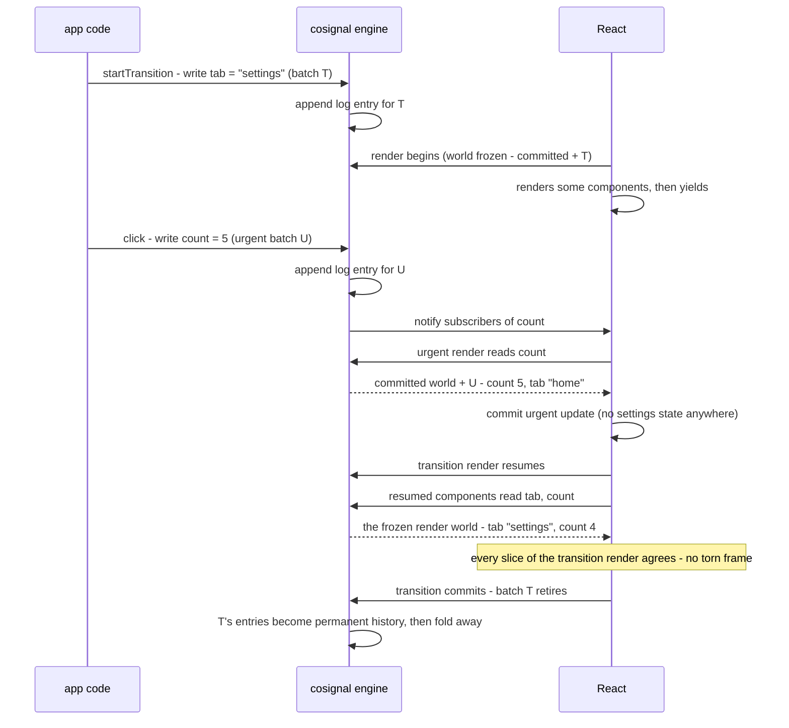
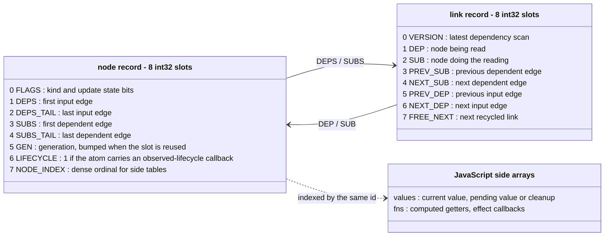
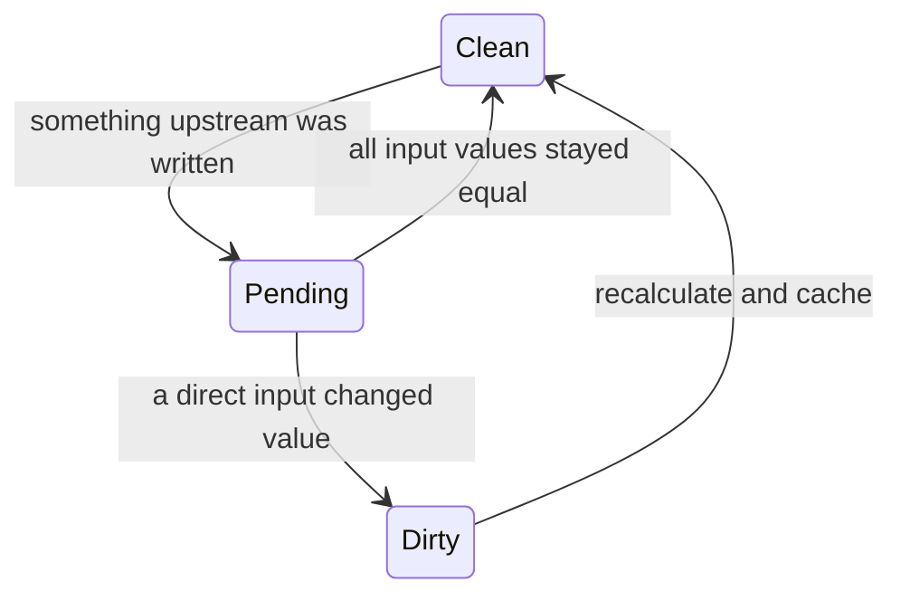

# cosignal

**cosignal** is a reactive state ("signals") library for JavaScript and
TypeScript, designed from the start for React's concurrent rendering. It
keeps derived values and effects in sync with changing state, stores its
dependency graph in packed integer arrays for speed, and — its defining
feature — can maintain **several consistent views of the same state at
once**, so a UI that renders in interruptible slices never shows a frame
that mixes old and new values.

You can use it standalone, with no React anywhere: atoms, computed values,
effects, and batching work as a plain, fast signals library. The concurrent
machinery engages only when something concurrent actually happens.

Two extra entry points are diagnostics: `cosignal/trace` (a zero-allocation
event recorder that answers "why did this re-render?") and
`cosignal/graphviz` (DOT renderers for the dependency graph and for causal
traces).

## How it works

Three primitives cover most programs:

- An **`Atom`** stores a value. Read `.state`; write with `.set(value)` or
  `.update(fn)`.
- A **`Computed`** derives and caches a value from atoms or other computeds.
- An **`effect`** runs a function now, then again when a value it read
  changes.

Dependencies are automatic: while a computed or effect runs, the library
records every atom and computed it reads.

```ts
import { Atom, Computed, effect, batch } from 'cosignal';

const count = new Atom(1);
const doubled = new Computed(() => count.state * 2);
const isEven = new Computed(() => count.state % 2 === 0);

const stop = effect(() => {
  console.log(doubled.state, isEven.state); // 2 false
});

count.set(2); // logs: 4 true
batch(() => {
  count.set(3);
  count.set(4); // the effect runs once, when the batch closes
});
stop();
```



Arrows point from a value to the work that depends on it. When `count`
changes, the effect is reachable through both computeds but runs only once.

Recomputing every downstream node on each write would waste work, and
recomputing dependents immediately could run an effect before all of its
inputs are current. Updates instead use a push-pull algorithm:

1. **Push:** a write marks downstream computeds and effects as possibly
   stale. Effects are queued; no user callback runs during this walk.
2. **Pull:** before a computed returns `.state`, it checks its dependencies
   and recalculates only if one actually changed value. A queued effect
   re-runs and pulls each computed it reads up to date. If a computed's
   value did not change, the update stops along that path.



## Concurrent worlds

This is the part other signals libraries do not have.

React's concurrent rendering splits work by urgency. A **transition**
(`startTransition`) marks an update as non-urgent: React renders it in the
background, over several interruptible slices, while urgent updates
(typing, clicks) keep landing and committing in between. That is safe for
React's own state because React keeps one value per pending update
internally — but an ordinary external store has just one current value. If
a paused background render resumes and reads the store again, or an urgent
render reads state that only a pending transition should see, a single
rendered frame can mix old and new state. That bug is called **tearing**.

cosignal removes the single-current-value limitation with three ideas:

- **Write log.** Every write that lands while something is pending is
  recorded as a compact log entry — which operation (set / functional
  update / reducer action), which batch it belongs to, and its position on
  one global timeline — appended to the written atom's write log. Entries
  are packed into parallel number arrays: recording a write is a few
  integer stores, not an object allocation.
- **Batches.** A batch groups the writes belonging to one UI update — one
  event handler, one transition, one async action. React schedules each
  batch at a single priority, and the engine keeps a batch's writes visible
  together or not at all.
- **Worlds.** A world is one self-consistent assignment of values to every
  signal, produced by replaying exactly the log entries that world is
  allowed to see, in timeline order, over each atom's base value. Three
  kinds exist: the **newest** world (every write applied — what effects and
  plain reads see), the **committed** world of a root (exactly what that
  root's on-screen UI reflects), and a **render** world (what one
  in-progress render may see: committed state plus its own batches, frozen
  at the moment the render started, so a paused-and-resumed render never
  drifts).

Because every world is a pure replay of the same log, a pending update and
the committed UI can never disagree about history — they only differ in how
much of it they are allowed to see. Here is an urgent write landing while a
transition's background render is paused:



The resumed transition render still sees exactly the state it started from
— including `count = 4` — so the frame it produces is internally
consistent. When React then re-renders the transition on top of the
committed urgent update, the new render starts from a fresh frozen view
that includes both batches.

When a batch is finished everywhere (committed or abandoned), it
**retires**: its writes become permanent history visible to every world,
and once no world can tell the difference, its log entries fold into each
atom's base value and are reclaimed. When nothing is pending at all, the
engine is **quiet**: a write folds directly into permanent history — no log
entry, no batch, no world is created — so an app that never starts a
transition pays almost nothing for any of this.

## API

### `new Atom(initial, options?)`

A writable signal.

- `.state` — read the current value. Inside a computed or effect this
  registers a dependency; inside a React component (via `cosignal-react`)
  it reads the world of the render in progress.
- `.set(value)` — replace the value.
- `.update(fn)` — apply a pure function to the current value.

Options:

- `isEqual?: (a, b) => boolean` — writes equal to the current value are
  dropped. Applies unconditionally while the atom has no pending recorded
  writes; once pending entries exist, equality applies per replay step
  instead, because different worlds may fold different previous values. The
  comparator is always called as `isEqual(currentValue, incomingValue)`.
- `label?: string` — debug name, used by the diagnostics entries.
- `effect?: (ctx) => void | (() => void)` — the **observed lifecycle**: runs
  when the atom gains its first subscriber of any kind — a computed chain
  or `effect()` here, or a React component subscribed through the bindings
  — and the returned cleanup runs once the last subscriber of every kind is
  gone. One observation state over that union: an atom watched by several
  kinds at once observes exactly once, and observe/unobserve flaps within
  one tick coalesce. `ctx` offers `state`, `set`, and `update`. Use it to
  wire an atom to an external subscription (a socket, a store) exactly
  while something is watching.

### `new ReducerAtom(reducer, initial, options?)`

An atom whose writes go through a reducer: `.dispatch(action)`. The reducer
is fixed at creation and **must be pure**, because the engine replays
dispatched actions to compute what different worlds should show — an impure
reducer would replay differently each time. Prefer it over `Atom` when
updates are a vocabulary of actions rather than raw values.

### `new Computed(fn, options?)`

A derived signal; `.state` evaluates on demand and caches. `fn` receives a
context object:

- `ctx.previous` — the last cached value, as a hint only: it may be stale
  or `undefined`, and the function must be correct without it. (Computeds
  used with the React bindings see the last *committed* value here.)
- `ctx.use(...)` — read an async value inside a computed, in two forms.
  Both follow the same contract as React's `use()`: a fulfilled promise
  returns its value, a rejected one throws its reason, and while a promise
  is pending, reads of the computed throw a stable `SuspendedRead` carrier
  (exported; the React bindings translate it into Suspense). Settlement
  re-evaluates the computed.
  - `ctx.use(promise)` — for a promise the **caller** caches (in a data
    layer or component state). The engine stores nothing; passing the same
    settled promise later reads its value synchronously.
  - `ctx.use(key, factory)` — the built-in cache: the computed keeps a
    per-key map of promises for its own lifetime, so the factory runs once
    per key and the same promise is reused across re-evaluations — even
    across interrupted and replayed renders. The key must carry every input
    that varies the request: `ctx.use(['user', userId], () =>
    fetchUser(userId))` — a different `userId` is a different key (a new
    fetch); the same `userId` reuses the same promise. Keys are strings,
    numbers, booleans, `null`, or arrays of those. The cache dies with the
    computed. (A bare factory with no key is rejected: an unkeyed, uncached
    promise would refetch on every re-evaluation.)

Options: `isEqual` (an equal result returns the previous reference, so
downstream consumers see no change — an equality cutoff, compared as
`isEqual(previous, next)`) and `label`.

Reading a computed while its own evaluation is running throws `CycleError`
— a computed may not depend on itself — instead of silently serving a stale
cache.

### `effect(fn)` and `effectScope(fn)`

`effect(fn)` runs `fn` immediately with dependency tracking and re-runs it
when any tracked signal changes. `fn` may return a cleanup function, run
before each re-run and at disposal. Returns a disposer. Effects always
observe the newest world — every write applied — because side effects
cannot be un-run and must not fire from speculative state. (For effects
that should track only what the user actually sees, use the React
bindings' `useSignalEffect`, which observes committed state.)

`effectScope(fn)` returns one disposer for every effect created inside
`fn`.

### `batch(fn)`, `startBatch()` / `endBatch()`

`batch(fn)` defers effect re-runs until `fn` returns, so a group of writes
triggers each affected effect once. Nothing else: batching never delays the
writes themselves, and reads inside a batch see them immediately.
`startBatch()`/`endBatch()` are the low-level pair for binding authors.
(This synchronous coalescing is unrelated to the concurrent engine's Batch
records, which group writes by UI update.)

### `untracked(fn)`

Reads inside `fn` register no dependencies. An untracked read is a
point-in-time sample: a computed that reads something only untracked is not
re-evaluated when that value changes.

### `configure(options)`

- `forbidWritesInComputeds?: boolean` — when true, any atom write during a
  computed evaluation throws. Off by default: writes inside computeds are
  tolerated as long as they do not re-enter the writing computed.
- `initialRecords?: number` — a capacity floor for the storage arena (in
  units of one node plus two dependency edges). Raising it before building
  a large graph avoids growth pauses; it never shrinks. Also settable via
  the `COSIGNAL_INITIAL_RECORDS` environment variable before first import.

Two disciplines are enforced at runtime because world replay depends on
them:

- **Updaters, reducers, and equality comparators must be pure.** They are
  stored and replayed per world, so reading or writing signals inside them
  throws. Read what you need first, then dispatch.
- **Writes during a render or world evaluation throw.** A speculative
  render must not mutate shared state; write from an event handler or an
  effect instead.

## Memory and reclamation

Signals are garbage-collected. There is no `dispose()` on atoms or
computeds and no ownership ceremony: when the last reference to an `Atom`
or `Computed` is dropped, its storage — the packed record, its dependency
edges, its cached values, any per-key request cache — is reclaimed
automatically, whether or not the signal still had subscribers, recorded
history, or a lifecycle callback. Effects are the exception, because a
running effect is itself a reason to stay alive: stop them with the
disposer that `effect()`/`effectScope()` returns.

The mechanism is a `FinalizationRegistry` (part of ES2021): the engine
notices when a handle has been collected and recovers its record. Records
that still have live consumers — a subscribed component, a pending
recorded write, a watched lifecycle — are protected by guards and recovered
the moment the last guard clears. User-supplied cleanup functions never run
inside the garbage collector's callback; they are deferred to a normal
engine boundary, so a throwing cleanup surfaces like any other application
error and the collector is never blocked on user code.

On runtimes without `FinalizationRegistry`, dropped handles keep a bounded
retention (their records are recycled through the deterministic paths
instead).

## Storage

Internally, every atom, computed, effect, and dependency edge is a
fixed-size record in one shared `Int32Array` — a contiguous arena, like an
array of structs in C. Reads, writes, and invalidation walks are index
arithmetic over those records: no per-operation allocation on hot paths,
nothing for the garbage collector to trace. A record id is the record's
starting offset in the array; id `0` means "none".



Node and link records share the arena, the 8-slot stride, and one
allocator. JavaScript values and functions cannot live in an `Int32Array`,
so they sit in ordinary arrays running parallel to the arena (the side
columns), indexed by shifting the same record id. Capacity grows by
rebuilding over doubled buffers at safe operation boundaries; freed records
are recycled through free lists.

The `FLAGS` slot carries the node's kind and its update state. A computed
moves through three states:



- **Clean:** the cached value is current (neither the `DIRTY` nor the
  `PENDING` flag bit is set).
- **Pending:** an input may have changed; the node must check its inputs
  before deciding whether to recalculate.
- **Dirty:** a direct input changed, so the node must recalculate before
  returning its value.

The reactive semantics are compatible with
[alien-signals](https://github.com/stackblitz/alien-signals) (the same
push-pull algorithm, re-expressed over arena records), validated against a
179-case conformance suite. The layout enums (`NodeField`, `LinkField`,
`NodeFlag`) are exported for tools that want to walk the graph themselves.

## The React driver

The concurrent engine is always present, but it only learns about renders,
batches, and commits from a **driver** — one small adapter record installed
with `attachDriver(driver)`, at most once per process. The driver answers
two questions per operation (which batch does this write belong to? which
world should this read resolve in?) and receives the engine's re-render
decisions as callbacks it schedules into the host's own lanes.

You will normally never call `attachDriver` yourself: the companion
package [`cosignal-react`](../cosignal-react/README.md) implements the
driver for a React build with external-runtime support and layers hooks
(`useSignal`, `useComputed`, `useSignalEffect`, `startSignalTransition`)
on top. Any UI library whose renderer groups updates by priority and can
speculatively render, then commit or discard, could implement the same
contract; the `engine` export carries the host-agnostic embedding surface
(batches, renders, commits, retirements, world reads).

## Diagnostics: `cosignal/trace` and `cosignal/graphviz`

`cosignal/trace` answers "why did this re-render / effect run / value
change?" without perturbing what it measures. Events are fixed-size integer
records written into preallocated buffers — no allocation per event — in
two modes: a **ring** (flight recorder: fixed memory, oldest events
overwritten) and a **session** (lossless capture in sealed chunks, with a
loud truncation marker if a byte budget is crossed). When no tracer is
attached, the entire cost is one field check per event site. Every record
names the event that provoked it, so causality is queryable:

```ts
import { engine } from 'cosignal';
import { attachTracer, formatTrace } from 'cosignal/trace';

const tracer = attachTracer(engine);
// ... exercise the app ...
console.log(formatTrace(tracer.events())); // "#id +Δµs kind(subject) …"
console.log(tracer.whyDelivered('w12'));   // the write → delivery chain
tracer.stop();
```

`cosignal/graphviz` renders DOT source (pipe it to `dot -Tsvg`):
`dependencyGraphToDot(engine)` snapshots the live dependency graph;
`traceToDot(events, filter?)` draws a trace as a causal graph — write →
delivery → correction chains. Each diagnostics entry loads independently:
importing the engine pulls in neither.

## Constraints

- **Purity where replay demands it.** Updaters, reducers, and equality
  comparators run under a guard that makes signal reads and writes inside
  them throw (see the API section). This is what makes worlds replayable.
- **One engine per process.** The engine composes at module initialization;
  there is nothing to construct. At most one driver can attach, and
  attaching twice throws. Test suites reset the engine between tests
  through a dedicated test-only entry point.
- **Writes during renders throw.** Speculative renders must not mutate
  shared state.
- **Evergreen runtimes.** The library targets modern JavaScript
  (`FinalizationRegistry`, ES2021); automatic reclamation degrades to
  bounded retention where it is missing.

## Testing

Two independent harnesses back the library's claims:

- **Conformance.** The core passes a 179-case conformance suite for
  alien-signals-compatible semantics — dependency tracking, lazy
  re-evaluation, equality cutoffs, effect scheduling, diamond graphs,
  conditional dependencies.
- **Model-based testing.** The concurrent engine is developed against an
  executable reference model: a deliberately simple, obviously-correct
  implementation of the same behavioral contract, plus an invariant
  checker, a seeded random schedule generator, and a shrinker that reduces
  any failure to a minimal reproduction. The engine replays pinned
  regression schedules and thousands of randomized interleavings (writes,
  renders, pauses, commits, abandons, mounts) in lockstep with the model,
  comparing every observable value and every notification decision after
  every step. The model ships as its own package, so the same harness can
  check alternative engine implementations.

## License

MIT
