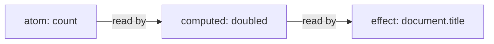

# cosignals

`cosignals` is a signals library with first-class support for React
transitions and concurrent rendering. Signals are reactive values that
live outside the component tree; the components, derived values, and side
effects that read them update automatically when they change.

What sets this library apart is how writes interact with React:

- Transition-aware writes: a write made inside `React.startTransition`
  stays invisible to the current screen until the transition commits,
  exactly like a `useState` update made in a transition. A typical
  external store cannot do this: it has one current value per key, so
  either the write shows up immediately (defeating the transition) or the
  background render cannot see it.
- `useState`-like scheduling: a signal write re-renders its subscribers
  with the same priority React would give a `setState` call from the same
  place. Bindings built on `useSyncExternalStore` instead render every
  store change at synchronous priority, no matter where the write came
  from.
- Async values as state: a computed can read a promise. The first load
  suspends through React Suspense; a refetch keeps showing the previous
  value while `isPending` reports that newer data is loading.
- Stock React: the bindings use only public React APIs — no patches, no
  build flags.

The root entry is React-free and dependency-free. The package splits into
entry points so an app only pays for what it imports:

- `cosignals`: create signals, derive values, react to changes, batch
  writes.
- `cosignals/react`: hooks and the provider that connect signals to
  components. Requires `react` and `react-dom` 19 or later as peer
  dependencies.
- `cosignals/ssr`: serialize and restore atom state across server and
  client.
- `cosignals/testing`: reset engine state between tests.
- `cosignals/debug` and `cosignals/unstable`: tracing, inspection, and
  engine integration seams, documented in [INTERNALS.md](./INTERNALS.md).

## Install

```sh
npm install cosignals
```

## Quick start

```tsx
import { createRoot } from 'react-dom/client'
import { createAtom, createComputed } from 'cosignals'
import { useValue, wrapCreateRoot } from 'cosignals/react'

const count = createAtom(0)
const doubled = createComputed(() => count.get() * 2)

function Counter() {
  const n = useValue(count)
  const d = useValue(doubled)
  return (
    <button onClick={() => count.set(n + 1)}>
      {n} doubled is {d}
    </button>
  )
}

const root = wrapCreateRoot(createRoot)(document.getElementById('root')!)
root.render(<Counter />)
```

Importing `cosignals/react` registers the React bindings with the engine
as a side effect — there is no setup call. `wrapCreateRoot` returns a
`createRoot` whose `render` wraps the tree in the provider the hooks
need; [SignalsFrameworkProvider](#setup) is the manual alternative.

## What are signals?

An **atom** stores a value you can change over time. It is like
`useState`, but it lives outside any component:

```ts
import { createAtom } from 'cosignals'

const count = createAtom(1)
count.get()                 // 1
count.set(2)                // replace the value
count.update((n) => n + 1)  // write as a function of the previous value
count.get()                 // 3
```

A **computed** derives a cached value from other signals, like `useMemo`
or a Redux selector. The signals its function reads become its
dependencies automatically, and it recomputes only when read after a
dependency changed:

```ts
import { createComputed } from 'cosignals'

const doubled = createComputed(() => count.get() * 2)
doubled.get()  // 6
count.set(10)
doubled.get()  // 20 — recomputed because count changed
doubled.get()  // 20 — cached, the function does not run again
```

An **effect** runs a side effect when signals change, like `useEffect`.
It is two functions with different jobs:

```ts
import { createEffect } from 'cosignals'

const stop = createEffect(
  () => doubled.get(),    // compute: tracked, its reads become dependencies
  (value, previous) => {  // handler: the side effect, untracked
    document.title = `doubled is ${value}`
  },
)
// the handler already ran once, with 20
count.set(3)  // handler runs with 6
stop()
```

The split exists so the engine can re-run the compute to check whether
anything actually changed without repeating the side effect. A write that
leaves the computed value equal runs no handler at all. Reads the effect
should react to belong in the compute; reads inside the handler are not
tracked.



Arrows point from a value to the work that depends on it. A write marks
downstream work as possibly stale and schedules effects, but nothing
recomputes until it is read. A computed that recomputes to an equal value
stops the update along that path, so its consumers never re-run.

## Signals and React transitions

React transitions let React prepare the next screen in the background
while the current one stays interactive: updates inside
`React.startTransition` render in low-priority passes, and the visible
tree keeps showing the old state until the new tree is ready to commit.

This works for `useState` because React keeps pending updates in
per-hook queues, and each render pass chooses which updates to apply.
`cosignals` gives atoms the same machinery:

- a write made inside a transition does not touch the atom; it is
  recorded in a draft attached to that transition;
- the committed screen, ordinary reads, and effects keep seeing the value
  without the draft;
- the transition's own render passes see the value with the draft
  applied;
- when the transition commits, the draft folds into the atom and every
  ordinary reader sees the change, once.

Functional updates recorded in a draft replay over urgent writes that
land in the meantime, in the order they were dispatched — the same rule
React applies to queued `useState` updaters. For a counter at 1:

```ts
const n = createAtom(1)
// inside a transition:  n.update((x) => x + 2)   — recorded in a draft
// then an urgent write: n.update((x) => x * 2)   — applies immediately
n.get()  // 2 — the screen shows 1 * 2; the draft is hidden
// the transition's render sees (1 + 2) * 2 = 6, and 6 is what commits
```

Keep updater functions pure, for the same reason React updaters must be
pure: they can replay.

## Atoms

`createAtom(initial, options?)` accepts options:

- `equals`: value equality for the write cutoff; defaults to `Object.is`.
  A write whose value compares equal to the current one is dropped, so
  nothing downstream re-runs.
- `label`: a debug name shown in trace output.
- `onObserved`: tie an external resource to the atom's observed lifetime
  (below).

Passing a function creates a lazy atom. The initializer runs once,
untracked, at the first read, write, or subscription — never at
construction:

```ts
const config = createAtom(() => loadConfig())
```

`onObserved` runs when the atom gains its first subscriber of any kind —
an effect, a watched computed chain, or a React component — and its
cleanup runs when the last subscriber of every kind is gone.
Subscribe/unsubscribe flaps within a tick coalesce, so a StrictMode
double-mount nets one activation:

```ts
const price = createAtom(0, {
  onObserved: ({ get, set }) => {
    const socket = subscribePrices(set)
    return () => socket.close()
  },
})
```

`createReducerAtom(reduce, initial, options?)` is an atom whose
`dispatch` method applies one reducer fixed at creation, like
`useReducer`:

```ts
import { createReducerAtom } from 'cosignals'

const todos = createReducerAtom(
  (state: Todo[], action: TodoAction) => applyTodoAction(state, action),
  [],
)
todos.dispatch({ type: 'add', text: 'write docs' })
```

A dispatch inside a transition is recorded and replayed like a
functional update, so keep the reducer pure.

## Computeds and async values

`createComputed(fn, options?)` takes the same `equals` and `label`
options as `createAtom`. Computeds are lazy and cached, and their
dependencies are dynamic: a branch not taken during an evaluation is not
a dependency, so a change to it causes no recompute.

The function receives two arguments: `use`, for reading promises, and
`previous`, the last settled value (or `undefined` on the first run).

`use(thenable)` returns the settled value or parks the evaluation until
the promise settles. What a read of an async computed returns depends on
the promise:

- settled: returns the settled value;
- loading again behind an earlier settled value (a refetch): keeps
  returning that earlier value, and `isPending` reports true;
- loading with nothing settled yet (a first load): throws the computed's
  stable pending promise, which React Suspense catches;
- failed: rethrows the same error object at every read site.

```ts
const userId = createAtom(1)
const user = createComputed((use) => use(fetchUser(userId.get())))
```

Settlement behaves like a write: dependents are notified and parked
readers retry. The pending promise is stable while a load is in flight,
so a suspended React render never re-issues the fetch.

Keep thenables stable per input set — derive them from state, as in the
example, with `fetchUser` caching its promise per id. A function that
creates a brand-new promise on every evaluation would refetch on every
settlement; that is a data-layer bug this library cannot paper over.

To refetch with unchanged inputs, own the trigger: keep a version atom,
read it inside the computed, and bump it to fetch again. A version bump
is an ordinary write, so it composes with everything writes do — inside a
transition, the refetch happens inside that transition and the current
screen holds:

```ts
const userVersion = createAtom(0)
const user = createComputed((use) =>
  use(fetchUser(userId.get(), userVersion.get())),
)

userVersion.update((v) => v + 1)  // refetch; user serves stale data while loading
```

## Effects

`createEffect(source, handler, options?)` returns a disposer. The source
declares what the effect reacts to:

- a compute function: tracked while it runs, so the signals it read — and
  only those — become dependencies, branch by branch. It is cached,
  handed its own previous value, and may read promises through `use`;
- a signal: shorthand for a compute that reads it;
- a tuple or record of signals: shorthand for a compute that reads each
  one into a same-shaped container of values.

```ts
createEffect(query, (q) => syncUrl(q))
createEffect([user, theme], ([u, t]) => paintHeader(u, t))
createEffect({ user, theme }, ({ user, theme }) => paintHeader(user, theme))
```

The container shorthands rebuild their tuple or record on every run, so
they default their cutoff to `shallowEquals` (exported for reuse); an
explicit `equals` option overrides.

The handler is called with the new value and the previous value it
handled, and may return a cleanup that runs before the next handler run
and at disposal. If the compute throws, the handler is not called and the
error surfaces where the effect runs.

The first run happens synchronously, at creation. Async sources relax
that:

- nothing has settled yet: the first handler run waits for the value;
- loading again behind an earlier value: the effect stays quiet and keeps
  the last cleanup installed (`isPending` is the loading indicator);
- a load completes: the handler runs only if the new value differs from
  the last one it handled.

The `schedule` option picks when signal-triggered re-runs happen:

- `'sync'` (the default): immediately, as part of the write;
- `'useLayoutEffect'` or `'useEffect'`: in that phase of the React update
  the change caused, alongside components' own effects of that phase.
  Without React mounted, a microtask or `setTimeout(0)` approximates the
  timing.

The first run at creation is always synchronous, whatever the schedule.
`flushScheduledEffects()` runs every scheduled effect immediately — for
tests and non-React environments where nothing else forces scheduled
work to a deterministic moment.

`effectScope(fn)` collects every effect created inside `fn` and returns
one disposer for the group:

```ts
import { effectScope } from 'cosignals'

const stopAll = effectScope(() => {
  createEffect(query, (q) => syncUrl(q))
  createEffect(theme, (t) => applyTheme(t))
})
stopAll()
```

Effects observe committed state only. They never see a transition's
pending writes; a transition reaches every effect exactly once, when it
commits, and a discarded transition never reaches them.

Ownership: effects and scopes hold graph edges until their disposer is
called. Computeds need no disposal — an unwatched computed only holds
references toward its dependencies, so dropping the last reference to it
makes the whole chain garbage-collectible.

## Reading values

Four ways to read a signal, each answering a different question:

```ts
import { latest, isPending } from 'cosignals'

count.get()       // current value; registers a dependency when tracked
count.peek()      // same value, but the reader does not subscribe
latest(count)     // newest value, pending transition writes included
isPending(count)  // is newer data loading behind the shown value?
```

- `get()`: inside a computed, an effect compute, or a subscribed
  component, the read registers a dependency, so the reader re-runs when
  the value changes. Ordinarily it returns the committed value, with
  pending transitions' writes hidden; inside a React render it returns
  the snapshot that render was given, including the writes of any
  transition the render belongs to.
- `peek()`: `get()` without the dependency. The reader sees the same
  value but never re-runs because of this signal.
- `latest(x)`: the newest view — committed state plus every pending
  transition's writes. It never suspends: an async computed that has
  never settled reads as `undefined` (a failed one still rethrows its
  error). Inside a computed evaluation or a render, `latest` resolves the
  caller's own snapshot instead of reading ahead, because mixing
  snapshots would show a torn view. In a computed or effect it is still a
  tracked dependency: when `x` changes, the reader re-runs.
- `isPending(x)`: true while newer data exists behind what is shown —
  a pending transition has written `x`, or an async computed is loading
  again behind its settled value. It is passive: it never evaluates,
  refetches, or suspends. A first load is not pending, because there is
  no stale data to indicate over; suspending on first load is Suspense's
  job.

`isSignal(x)` returns true when `x` is an atom or computed from this
library, useful for APIs that accept either signals or plain values.

## Batching and untrack

`batch(fn)` runs `fn` as one unit of change. Writes inside still apply in
order, but computeds, effects, and subscribers settle only after the
outermost batch closes — so intermediate states never leak out, and a
value that changes and reverts within one batch runs no effects:

```ts
import { batch } from 'cosignals'

const firstName = createAtom('Grace')
const lastName = createAtom('Hopper')
const fullName = createComputed(() => `${firstName.get()} ${lastName.get()}`)

batch(() => {
  firstName.set('Ada')
  lastName.set('Lovelace')
})
// fullName recomputed once; effects over it ran once
```

`startBatch()` and `endBatch()` are the manual pair for work that does
not fit in one callback; pair every call, and prefer `batch` when the
work fits.

`untrack(fn)` runs `fn` without adding its signal reads to the active
dependency list. Use it inside a compute for values the computation uses
but should not react to:

```ts
import { untrack } from 'cosignals'

const results = createComputed(() => {
  const q = query.get()                             // dependency
  const limit = untrack(() => pageSize.get())       // not a dependency
  return search(q, limit)
})
```

## React

### Setup

Importing `cosignals/react` registers the bindings with the engine
automatically. (`registerReactSignals` remains exported for code that
wants the returned handle, whose `dispose()` removes the registration;
applications do not need it.)

The subscribing hooks — `useValue`, `useComputed`, and `useIsPending` —
require a `SignalsFrameworkProvider` above them and throw without one.
The provider is the channel that delivers transitions to its subtree, so
a subscriber outside one could never see them. Two ways to set it up:

- `wrapCreateRoot(createRoot)`: a `createRoot` whose `render` wraps the
  tree in a provider, as in the quick start;
- `<SignalsFrameworkProvider>` mounted directly, once per root.
  Providers cannot be nested.

`useSignalEffect` and `useSignalLayoutEffect` observe committed state,
which needs no channel, so they work without a provider — as do the
plain function reads (`latest`, `isPending`).

Multiple roots are supported: one transition can span them, and each
root's render passes stay internally consistent.

### Hooks

- `useValue(x)`: read a signal and subscribe. The component re-renders
  whenever the value it would show changes. On async values: a first
  load suspends; a refetch keeps showing the settled value, with
  `useIsPending` as the loading indicator; a render inside a transition
  suspends into the transition, so the current screen holds instead of
  showing a fallback.
- `useComputed(fn, deps)`: a component-owned computed. `fn` gets the
  same `(use, previous)` arguments as a `createComputed` body, and the
  computed is recreated when `deps` change. No disposal is needed;
  dropping it at unmount makes it garbage-collectible.
- `useAtom(initial, opts?)`: a component-owned atom, created once on
  mount and garbage-collected after unmount.
- `useIsPending(x)`: `isPending` as a subscription. The flip is
  delivered urgently, outside any transition — an indicator must not be
  held back by the transition it indicates. React's own `useTransition`
  schedules its `isPending` the same way.
- `useSignalEffect(() => ({ watch, run, equals?, label? }), deps)` and
  `useSignalLayoutEffect(...)`: a component-owned effect. `watch` is the
  effect's source (the same shapes `createEffect` accepts) and `run` is
  its handler. The factory runs on mount and on every `deps` change,
  disposing the previous effect first — exactly `useEffect`'s re-create
  cycle — so captured props and state are always fresh with respect to
  `deps`.

```tsx
useSignalEffect(() => ({
  watch: query,                 // or [a, b], { a, b }, () => a.get() + b.get()
  run: (q) => analytics.search(q),
}), [])
```

Because one closure carries every capture, `react-hooks/exhaustive-deps`
can check the whole spec once the hooks are listed:

```jsonc
"react-hooks/exhaustive-deps": ["error", {
  "additionalHooks": "(useSignalEffect|useSignalLayoutEffect)"
}]
```

### Transitions

```tsx
import { useSignalTransition } from 'cosignals/react'

const filter = createAtom('all')

function FilterTabs() {
  const [pending, startTransition] = useSignalTransition()
  const current = useValue(filter)
  return (
    <div style={{ opacity: pending ? 0.6 : 1 }}>
      {['all', 'open', 'done'].map((f) => (
        <button key={f} onClick={() => startTransition(() => filter.set(f))}>
          {f === current ? `[${f}]` : f}
        </button>
      ))}
    </div>
  )
}
```

- `startSignalTransition(fn)`: `React.startTransition` plus one signal
  batch, for writes started outside a component.
- `useSignalTransition()`: React's `useTransition` combined with a
  signal batch; `pending` covers the transition's whole lifetime,
  including renders held by Suspense.
- Plain `React.startTransition` also works: the first signal write
  inside any transition is classified into a draft automatically. The
  wrappers just add the batch.

While the transition is pending, its writes are visible only to its own
render passes — `useValue` in the work-in-progress tree sees them, while
the committed screen, `get()` outside renders, and effects do not. When
it commits, the writes land everywhere at once.

### Write timing

Every re-render caused by a signal write gets the scheduling React would
give a `setState` from the same place:

- a click handler: renders synchronously, before the next paint;
- a timeout, promise, or network callback: default priority, which can
  land after a paint — wrap the write in `flushSync` when the DOM must
  update immediately, exactly as for React state;
- inside a transition: the transition's own render passes.

A signal write and a `setState` in the same callback commit in one
render.

Writing to an atom during a render throws. Write in event handlers and
effects instead.

## Server rendering

`cosignals/ssr` moves atom state across the server/client boundary:

```ts
import { initializeAtomState, installState, serializeAtomState } from 'cosignals/ssr'

// server, after rendering:
const json = serializeAtomState({ count, query })  // or an array of atoms

// client, before hydrating:
initializeAtomState(json, { count, query })

// or one atom at a time:
installState(count, 42)
```

Installing is not a write: no propagation, no equality check, no effects,
and lazy initializers do not run — the installed value satisfies the
first read.

## Testing

Engine state is module-global (live transition drafts, scheduled
effects, tracers), so tests that use transitions or effects should reset
between cases:

```ts
import { resetEngineForTest } from 'cosignals/testing'

beforeEach(() => {
  resetEngineForTest()
})
```

Existing atoms stay valid across a reset. Application code should never
import this entry.

## Going deeper

Integrating another framework, building devtools, or curious how the
engine works? [INTERNALS.md](./INTERNALS.md) covers the architecture and
the `cosignals/unstable` and `cosignals/debug` entry points.
