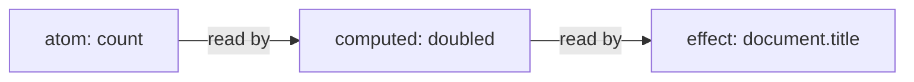

# cosignals

[Signals](https://github.com/tc39/proposal-signals) for React with first-class
support for transitions and concurrent rendering. See
[What are signals?](#what-are-signals) for an introduction.

- **Transitions**: a write inside `React.startTransition` stays invisible to
  the current screen until the transition commits, exactly like a `useState`
  update. A typical external store cannot do this: it has one current value; it
  must expose the write immediately or hide it from the background render.
  [Details](#transition-writes).
- **Async / Suspense**: a computed signal [can suspend](#async-computeds) with
  `use(promise)` like a React component. It re-runs once the promise settles. On
  the first run, components downstream suspend; if there's a previous value,
  downstream signals and components see that while waiting.
- **Scheduling**: a signal write re-renders its subscribers
  with the same priority React would give a `setState` call from the
  same place. In contrast, `useSyncExternalStore` renders every store change at
  synchronous priority.
- **Multiple roots**: each root has its own concurrent state, unlike the experimental
  [react-concurrent-store](https://github.com/thejustinwalsh/react-concurrent-store)
  polyfill. _I'm not sure if it's completely correct though._
- **Beware: uses React internals**: some of these magicks rely on React internals; if
  you use this library, you may not be able to upgrade React. Tested with React
  18.2.0 - 19.3.0 (unreleased as of 2026-07-18).

```tsx
import { createRoot } from "react-dom/client"
import {
  CosignalsProvider,
  createAtom,
  createComputed,
  useSignal,
  useSignalEffect,
} from "cosignals"

// Signals can live outside the tree
// and be shared directly or through context.
const count = createAtom(0)
const doubled = createComputed(() => count.get() * 2)

function Counter() {
  const n = useSignal(count) // read and subscribe: re-renders on change
  return <button onClick={() => count.update((c) => c + 1)}>{n}</button>
}

function App() {
  // React to signals without re-rendering: clicks re-render Counter,
  // never App.
  useSignalEffect(
    () => ({
      watch: doubled,
      run: (value) => {
        document.title = `doubled is ${value}`
      },
    }),
    [],
  )
  return <Counter />
}

createRoot(document.getElementById("root")!).render(
  <CosignalsProvider>
    <App />
  </CosignalsProvider>,
)
```

## Usage

Install:

```sh
pnpm add cosignals
npm add cosignals
yarn add cosignals
bun add cosignals
```

`cosignals` requires `react` and `react-dom` 18.2 or later as peer dependencies.
You must render `<CosignalsProvider>` as your React root:

```tsx
import { createRoot } from "react-dom/client"
import { CosignalsProvider } from "cosignals"
import { App } from "./App"

createRoot(document.getElementById("root")!).render(
  <CosignalsProvider>
    <App />
  </CosignalsProvider>,
)
```

Configure your linter to check [signal effects](#usesignaleffect):

```jsonc
"react-hooks/exhaustive-deps": ["error", {
  "additionalHooks": "(useSignalEffect|useSignalLayoutEffect)"
}]
```

Available modules:

- `cosignals`: the core signals API, React hooks, and
  `CosignalsProvider`. Importing it registers the React integration.
- `cosignals/core`: the React-free signals API for creating signals, deriving
  values, reacting to changes, and batching writes.
- `cosignals/react`: hooks and the provider that connect signals to
  components. This subpath remains available for split imports.
- `cosignals/ssr`: serialize and restore atom state across server and
  client. _Experimental_.
- `cosignals/testing`: reset engine state between tests.
- `cosignals/debug` and `cosignals/unstable`: tracing, inspection, and engine
  integration seams, documented in [INTERNALS.md](./INTERNALS.md). _Experimental_.

## What are signals?

_Signals_ are a state management system made up of _atoms_, _computeds_, and
_effects_, which form a graph of automatically-tracked dependency relationships:



A write to an atom _pushes invalidation_: it marks downstream work as possibly
stale and schedules effects for revalidation. When a computed is read or a
scheduled effect revalidates, it _pulls_ values from its upstream signals. If
all upstream computeds recompute to equal values, the update stops. If the
computed or effect's inputs change, then they re-run.

## API

### Atoms

An **atom** stores a value you can change over time. It is like
`useState`, but it lives outside any component:

```ts
import { createAtom } from "cosignals"

const count = createAtom(1)
count.get() // 1
count.set(2) // replace the value
count.update((n) => n + 1) // write as a function of the previous value
count.get() // 3
```

In React, `useSignal` reads an atom's state value and subscribes so the
component re-renders when the atom's value changes.

You can create an atom inside a component with `useAtom`, which does not
subscribe to it.

```tsx
import { useAtom, useSignal } from "cosignals/react"

function SearchBox() {
  const query = useAtom("") // this component's own atom
  const q = useSignal(query) // subscribe to it (or to any shared atom)
  return <input value={q} onChange={(e) => query.set(e.target.value)} />
}
```

`createAtom(initial, options?)` / `useAtom(initial, options?)`:

- `initial`: The initial state value of the atom. Can be a function to create
  state lazily.
- `equals`: compares state values. If `equals(prev, next)` returns true for a
  `set` or `update`, the write is dropped and nothing downstream re-runs.
  Defaults to `Object.is`.
- `label`: a debug name shown in developer tools.
- `onObserved`: tie an external resource to the atom's observed
  lifetime (below).

Passing a function creates a lazy atom. The initializer runs once,
untracked, at the first read, write, or subscription:

```ts
const config = createAtom(() => loadConfig())
```

`onObserved` is a `useEffect`-like callback that allows binding external
resources to an atom's state. It runs when the atom gains its first subscriber
(effect, computed, or component) and should return a `cleanup` function. Its
cleanup runs when the last subscriber is removed.

```ts
const price = createAtom(0, {
  onObserved: ({ get, set }) => {
    const socket = subscribePrices(set)
    return () => socket.close()
  },
})
```

### Reducer atoms

`createReducerAtom(reduce, initial, options?)` is an atom with a
`dispatch(action)` method that applies `reduce(state, action)`, like
`useReducer`. Read it with `get()` or `useSignal` like any other atom, and
dispatch from event handlers or effects:

```ts
import { createReducerAtom } from "cosignals"

const todos = createReducerAtom(
  (state: Todo[], action: TodoAction) => applyTodoAction(state, action),
  [],
)
todos.dispatch({ type: "add", text: "write docs" })
```

A dispatch inside a transition is recorded and may be replayed, so reducer
functions should be pure.

### Computeds

A **computed** derives a cached value from other signals, like `useMemo`
or a Redux selector. The signals its function reads become its
dependencies automatically, and it recomputes only when read after a
dependency changed:

```ts
import { createComputed } from "cosignals"

const doubled = createComputed(() => count.get() * 2)
doubled.get() // 6
count.set(10)
doubled.get() // 20; recomputed because count changed
doubled.get() // 20; cached without running the function again
```

Dependencies are dynamic: a branch not taken during an evaluation is
not a dependency, so changing it does not trigger recomputation. The function
receives two arguments: `use` reads promises (see
[async computeds](#async-computeds)), and `previous` is the last settled value
(`undefined` on the first run).

`createComputed(fn, options?)` takes the same `equals` and `label`
options as `createAtom`; `equals` decides whether a recomputed value
counts as changed for consumers downstream.

In React, `useComputed(fn, deps)` creates a component-owned computed and returns
its value. The computed is re-created when its `deps` (eg from props or
React state) change.

```tsx
import { useComputed, useSignal } from "cosignals/react"

function Total({ taxRate }: { taxRate: number }) {
  const total = useComputed(() => subtotal.get() * (1 + taxRate), [taxRate])
  return <span>{total}</span>
}
```

### Effects

An **effect** runs a side effect when signals change, like `useEffect`.
Effects have two parts:

- `watch`: what the effect reacts to, a dependency-tracked compute function, a
  signal, or a simple tuple or record of signals.
- `run`: the side effect, untracked. It is called with the new value and
  the previous value it handled, and may return a cleanup that runs
  before the next `run` and at disposal.

Effects observe committed state: a transition reaches every effect
exactly once when it commits. An abandoned transition reaches no effects.

#### useSignalEffect

A component-owned effect. Its body function returns an options object `{ watch,
run, equals?, label? }`. The body is called on mount and whenever `deps` change.
Before re-running, it disposes the previous effect so captured props and state
stay current.

The effect subscribes to its watched signals directly, so a component
can react to signal changes without re-rendering.

`watch` takes three shapes:

- When watching one signal, `run` receives its value:

  ```tsx
  useSignalEffect(
    () => ({
      watch: query,
      run: (q) => analytics.search(q),
    }),
    [],
  )
  ```

- When watching a tuple or record of signals, `run` receives values in the same
  shape:

  ```tsx
  useSignalEffect(
    () => ({
      watch: [user, theme],
      run: ([u, t]) => paintHeader(u, t),
    }),
    [],
  )

  useSignalEffect(
    () => ({
      watch: { user, theme },
      run: ({ user, theme }) => paintHeader(user, theme),
    }),
    [],
  )
  ```

- When watching a compute function, the signals read by the executed branches
  become dependencies. `run` receives the function's result:

  ```tsx
  useSignalEffect(
    () => ({
      watch: () => matchRoute(pathname.get(), routes.get()),
      run: (route) => announcePageChange(route.title),
    }),
    [],
  )
  ```

Because one closure carries every capture, `react-hooks/exhaustive-deps`
can check the whole spec once the hooks are listed:

```jsonc
"react-hooks/exhaustive-deps": ["error", {
  "additionalHooks": "(useSignalEffect|useSignalLayoutEffect)"
}]
```

#### useSignalLayoutEffect

The same factory and spec as `useSignalEffect`, but `run` fires in the
layout phase after DOM mutations and before paint, like `useLayoutEffect`. Use
it when the handler measures or mutates the DOM and the result must appear in
the same frame.

#### createEffect

Use `createEffect` for effects owned outside the component tree, such as module
scope, stores, or non-React code. It takes the watch source and handler as
direct arguments and returns a disposer:

```ts
import { createEffect } from "cosignals"

// one signal
const stop = createEffect(query, (q) => syncUrl(q))

// a tuple or record of signals
createEffect([user, theme], ([u, t]) => paintHeader(u, t))
createEffect({ user, theme }, ({ user, theme }) => paintHeader(user, theme))

// a compute function
createEffect(
  () => doubled.get(),
  (value, previous) => {
    document.title = `doubled is ${value}`
  },
)

stop() // dispose: run the last cleanup, drop the graph edges
```

The tuple and record shorthands rebuild their container on every run. They use
the exported `shallowEquals` function by default. An explicit `equals` option
overrides it. If `watch` throws, the error surfaces where the effect runs.

The first run happens synchronously, at creation. Async sources relax
that:

- nothing has settled yet: the handler waits for the first value.
- loading again behind an earlier value: the effect keeps the last cleanup
  installed and does not run. Use `isPending` as the loading indicator.
- a load completes: the handler runs only if the new value differs from
  the last one it handled.

The `schedule` option picks when signal-triggered re-runs happen:

- `'sync'` (the default): immediately, as part of the write.
- `'useLayoutEffect'` or `'useEffect'`: in that phase of the React
  update the change caused, alongside components' own effects of that
  phase. Without React mounted, a microtask or `setTimeout(0)`
  approximates the timing.

The first run at creation is always synchronous, whatever the schedule.
`flushScheduledEffects()` runs every scheduled effect immediately. Use it in
tests and non-React environments that need deterministic timing.

`effectScope(fn)` collects every effect created inside `fn` and returns
one disposer for the group:

```ts
import { effectScope } from "cosignals"

const stopAll = effectScope(() => {
  createEffect(query, (q) => syncUrl(q))
  createEffect(theme, (t) => applyTheme(t))
})
stopAll()
```

Effects and scopes stay subscribed until their disposer is called. Undisposed
effects run forever.

## Transitions and async

A pending transition and an in-flight refetch both prepare newer state behind
the current screen. In either case, reads keep returning the current value
while the newer one is prepared. Use `isPending` and `latest` to inspect the
pending state.

### Transition writes

React transitions let React prepare the next screen in the background
while the current one stays interactive: updates inside
`React.startTransition` render in low-priority passes, and the visible
tree keeps showing the old state until the new tree is ready to commit.

This works for `useState` because React keeps pending updates in
per-hook queues, and each render pass chooses which updates to apply.
`cosignals` gives atoms the same machinery:

- a write made inside a transition is recorded in a draft attached to
  that transition, leaving the atom unchanged.
- the committed screen, ordinary reads, and effects keep seeing the
  value without the draft.
- the transition's own render passes see the value with the draft
  applied.
- when the transition commits, the draft folds into the atom and every
  ordinary reader sees the change once.

Functional updates recorded in a draft replay over urgent writes that
land in the meantime, in dispatch order. React applies the same rule to queued
`useState` updaters. For a counter at 1:

```ts
const n = createAtom(1)
// Inside a transition, n.update((x) => x + 2) is recorded in a draft.
// An urgent n.update((x) => x * 2) then applies immediately.
n.get() // 2; the screen shows 1 * 2 while the draft stays hidden
// the transition's render sees (1 + 2) * 2 = 6, and 6 is what commits
```

Keep updater functions pure, for the same reason React updaters must be
pure: they can replay.

### useSignalTransition and startSignalTransition

```tsx
import { useSignalTransition } from "cosignals/react"

const filter = createAtom("all")

function FilterTabs() {
  const [pending, startTransition] = useSignalTransition()
  const current = useSignal(filter)
  return (
    <div style={{ opacity: pending ? 0.6 : 1 }}>
      {["all", "open", "done"].map((f) => (
        <button key={f} onClick={() => startTransition(() => filter.set(f))}>
          {f === current ? `[${f}]` : f}
        </button>
      ))}
    </div>
  )
}
```

- `useSignalTransition()`: React's `useTransition` combined with a
  signal batch; `pending` covers the full transition,
  including renders held by Suspense.
- `startSignalTransition(fn)`: `React.startTransition` plus one signal
  batch, for writes started outside a component.
- Plain `React.startTransition` also works: the first signal write
  inside any transition is classified into a draft automatically. The
  wrappers just add the batch.

While the transition is pending, its writes are visible only to its own
render passes. `useSignal` in the work-in-progress tree sees them. The committed
screen, `get()` outside renders, and effects keep seeing the old value. On
commit, the writes become visible everywhere.

### Async computeds

A computed reads a promise through its `use` argument. `use(thenable)`
returns the settled value or suspends the evaluation until the promise settles:

```ts
const userId = createAtom(1)
const user = createComputed((use) => use(fetchUser(userId.get())))
```

What a read of an async computed returns depends on the promise:

- settled: returns the settled value.
- loading again behind an earlier settled value (a refetch): keeps
  returning that earlier value, and `isPending` reports true.
- loading with nothing settled yet (a first load): throws the
  computed's stable pending promise, which React Suspense catches.
- failed: rethrows the same error object at every read site.

Under `useSignal`, that means: a first load suspends the component; a
refetch keeps showing the settled value, with `useIsPending` as the
loading indicator; and a render inside a transition suspends into the
transition, so the current screen holds instead of showing a fallback.

Settlement behaves like a write: dependents are notified and suspended readers
retry. The pending promise is stable while a load is in flight,
so a suspended React render never re-issues the fetch.

Promises passed to `use` must be cached so the same Promise instance is used
across re-computes, [like with React's `use`](https://react.dev/reference/react/use#caching-promises-for-client-components).
In this example, `fetchUser` must cache its promise by ID. Creating a new
promise on every evaluation causes another fetch after every settlement.

_Refresh pattern_: To refetch with unchanged inputs, create a version atom. Read
it inside the computed and increment it to fetch again. The increment is an
ordinary write. Inside a transition, the refetch joins that transition and the
current screen stays visible:

```ts
const userVersion = createAtom(0)
const user = createComputed((use) => use(fetchUser(userId.get(), userVersion.get())))

userVersion.update((v) => v + 1) // refetch; user serves stale data while loading
```

### isPending and useIsPending

`isPending(x)` is true when a transition has written `x` or an async computed
is reloading behind its settled value. It does not evaluate, refetch, or suspend
the computed as `get()` might. It returns false during the first load because no
earlier value exists; Suspense handles that case.

`useIsPending(x)` subscribes a component to `isPending(x)`. Changes to
`isPending(x)` are delivered urgently, like how React's `useTransition` reports
its `isPending`.

### latest

`latest(x)` reads committed state plus every pending transition's writes. If a
plain read would suspend because an async computed has never settled, `latest`
returns `undefined`. A failed computed still rethrows its error.

Inside a computed evaluation or a render, `latest` resolves the
caller's own snapshot instead of reading ahead, because mixing
snapshots would show a torn view. In a computed or effect it is still a
tracked dependency: when `x` changes, the reader re-runs.

### Write timing

Every re-render caused by a signal write gets the scheduling React
would give a `setState` from the same place:

- a DOM event handler: renders synchronously, before the next paint.
- a timeout, promise, or network callback: default priority, which can
  land after a paint. Wrap the write in `flushSync` when the DOM must
  update immediately, as with React state.
- inside a transition: the transition's own render passes.

A signal write and a `setState` in the same callback commit in one
render.

Writing to an atom during a render throws. Write in event handlers and
effects instead.

## Batching and untracked reads

### batch

`batch(fn)` groups writes. They apply in order, but computeds, effects, and
subscribers settle only after the outermost batch closes. Intermediate states
stay hidden, and a value that changes and reverts within one batch runs no
effects:

```ts
import { batch } from "cosignals"

const firstName = createAtom("Grace")
const lastName = createAtom("Hopper")
const fullName = createComputed(() => `${firstName.get()} ${lastName.get()}`)

batch(() => {
  firstName.set("Ada")
  lastName.set("Lovelace")
})
// fullName recomputes once, and its effects run once.
```

`startBatch()` and `endBatch()` are the manual pair for work that does
not fit in one callback; pair every call, and prefer `batch` when the
work fits.

### untrack and peek

`untrack(fn)` returns `fn()` without adding its signal reads to the active
dependency list. Use it inside a watch or computed for values the computation
uses but should not react to:

```ts
import { untrack } from "cosignals"

const results = createComputed(() => {
  const q = query.get() // dependency
  const limit = untrack(() => pageSize.get()) // not a dependency
  return search(q, limit)
})
```

`signal.peek()` reads the signal's value without it becoming a dependency,
like `untrack(() => x.get())`. This is usually a bad idea: the reader
keeps working from the peeked value after it goes stale.

### isSignal

`isSignal(x)` returns true when `x` is an atom or computed from this
library, useful for APIs that accept either signals or plain values.

## Server rendering

`cosignals/ssr` transfers atom state from the server to the client:

```ts
import { initializeAtomState, installState, serializeAtomState } from "cosignals/ssr"

// server, after rendering:
const json = serializeAtomState({ count, query }) // or an array of atoms

// client, before hydrating:
initializeAtomState(json, { count, query })

// or one atom at a time:
installState(count, 42)
```

Installing state sets the value directly. It skips propagation, equality
checks, effects, and lazy initializers. _Beware_.

## Testing

Transition drafts, scheduled effects, and tracers use module-level state. Tests
that use transitions or effects should reset it between cases:

```ts
import { resetEngineForTest } from "cosignals/testing"

beforeEach(() => {
  resetEngineForTest()
})
```

Existing atoms stay valid across a reset.

## Internals

See [INTERNALS.md](./INTERNALS.md) to integrate another framework, build
developer tools, or understand the engine. It also documents the
`cosignals/unstable` and `cosignals/debug` entry points.

## Performance

The [justjake/js-reactivity-benchmark](https://github.com/justjake/js-reactivity-benchmark)
fork of [milomg/js-reactivity-benchmark](https://github.com/milomg/js-reactivity-benchmark)
uses median-of-N timing, one process per framework, and interleaved rounds to
reduce shared-runner noise. It measures signal creation and propagation without
React.

### Node

[](https://github.com/justjake/signals-design-space/actions/runs/29651689988)

Raw data: [CSV](https://github.com/justjake/signals-design-space/blob/main/docs/performance/results-node.csv).

### Bun

[](https://github.com/justjake/signals-design-space/actions/runs/29651689988)

Raw data: [CSV](https://github.com/justjake/signals-design-space/blob/main/docs/performance/results-bun.csv).

Source: [CI run](https://github.com/justjake/signals-design-space/actions/runs/29651689988).

### React

The [React seam benchmark](https://github.com/justjake/signals-design-space/tree/main/packages/react-seam-bench)
runs fan-out updates, transitions under load, and mount scenarios through each
library's React binding. It uses ReactDOM and jsdom, so the chart measures
JavaScript work without browser layout or paint.

[](https://github.com/justjake/signals-design-space/actions/runs/29660871980)

Raw data: [CSV](https://github.com/justjake/signals-design-space/blob/main/docs/performance/react-results.csv).
Source: [CI run](https://github.com/justjake/signals-design-space/actions/runs/29660871980).

Each chart reports the median of three interleaved rounds on a GitHub Actions
x86_64 runner. Runtime versions are printed in each chart. Compare contenders
within one chart; hosted runner differences below about 5% are noise. Totals
combine different workloads and are not application performance predictions.

## See also

- [cosignals-arena](https://www.npmjs.com/package/cosignals-arena): a
  data-oriented build with the same API and semantics. It stores the reactive
  graph in fixed-capacity typed-array records instead of JavaScript objects.
  This may improve speed but makes the implementation harder to understand.
- [dalien-signals](https://www.npmjs.com/package/dalien-signals): a fork
  of [alien-signals](https://www.npmjs.com/package/alien-signals) with a
  data-oriented memory layout. It is likely faster, but does not support React
  concurrent rendering or transitions.

## Thanks

- [Sophie Alpert](https://twitter.com/sophiebits) for teaching me about
  React concurrent rendering and why it matters.
- [Johnson Chu](https://twitter.com/johnsoncodehk) for
  [alien-signals](https://github.com/stackblitz/alien-signals), the basis
  of the fast linked-list signals graph.
- [Ryan Carniato](https://twitter.com/RyanCarniato) and
  [the SolidJS](https://github.com/solidjs) team for
  [SolidJS 2](https://github.com/solidjs/solid), which inspired this
  package's API shape and support for async.
- [Milo M](https://twitter.com/milomg__) for
  [reactively](https://github.com/milomg/reactively) and the
  [js-reactivity-benchmark](https://github.com/milomg/js-reactivity-benchmark).
  Gotta go fast.
