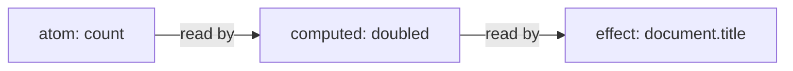

# cosignals

Signals for React with first-class support for transitions and
concurrent rendering. Signals are reactive values that live outside the
component tree; components, derived values, and side effects that read
them update automatically as they change.

What sets `cosignals` apart is how writes interact with React:

- Transition-aware writes: a write inside `React.startTransition` stays
  invisible to the current screen until the transition commits, exactly
  like a `useState` update. A typical external store cannot do this: it
  has one current value per key, so either the write shows up
  immediately everywhere (defeating the transition) or the background
  render cannot see it.
- `useState`-like scheduling: a signal write re-renders its subscribers
  with the same priority React would give a `setState` call from the
  same place, where `useSyncExternalStore` bindings render every store
  change at synchronous priority.
- Async values as state: a computed can read a promise. The first load
  suspends through React Suspense; a refetch keeps showing the previous
  value while `isPending` reports that newer data is loading.
- *Uses React internals*. If you depend on this library, you may not be
  able to upgrade React.

```tsx
import { createRoot } from "react-dom/client"
import { createAtom, createComputed } from "cosignals"
import { CosignalsProvider, useSignal, useSignalEffect } from "cosignals/react"

// Signals may live outside the tree; share them across components freely or via context.
const count = createAtom(0)
const doubled = createComputed(() => count.get() * 2)

function Counter() {
  const n = useSignal(count) // read and subscribe: re-renders on change
  return <button onClick={() => count.update((c) => c + 1)}>{n}</button>
}

function App() {
  // React to signals without re-rendering: clicks re-render Counter,
  // never App.
  useSignalEffect(
    () => ({
      watch: doubled,
      run: (value) => {
        document.title = `doubled is ${value}`
      },
    }),
    [],
  )
  return <Counter />
}

createRoot(document.getElementById("root")!).render(
  <CosignalsProvider>
    <App />
  </CosignalsProvider>,
)
```

## Usage

Install:

```sh
pnpm add cosignals
# or: npm install cosignals · yarn add cosignals · bun add cosignals
```

`cosignals/react` requires `react` and `react-dom` 18.2 or later as peer
dependencies.

Import what you need. The package splits into entry points so an app
only pays for what it imports:

- `cosignals`: create signals, derive values, react to changes, batch
  writes — `createAtom`, `createComputed`, `createEffect`, `batch`,
  `latest`, `isPending`. React-free and dependency-free.
- `cosignals/react`: hooks and the provider that connect signals to
  components — `useSignal`, `useComputed`, `useSignalEffect`,
  `useSignalTransition`, `CosignalsProvider`.
- `cosignals/ssr`: serialize and restore atom state across server and
  client.
- `cosignals/testing`: reset engine state between tests.
- `cosignals/debug` and `cosignals/unstable`: tracing, inspection, and
  engine integration seams, documented in [INTERNALS.md](./INTERNALS.md).

Render `<CosignalsProvider>` at the top of each root, as in the example
up top. The subscribing hooks — `useSignal`, `useComputed`, and
`useIsPending` — require a provider above them and throw without one; it
is the channel that delivers transitions to its subtree. Providers
cannot be nested.

`useSignalEffect`, `useSignalLayoutEffect`, and the plain function
reads (`latest`, `isPending`) observe committed state, so they work
with or without a provider. Multiple roots are
supported: one transition can span them, and each root's render passes
stay internally consistent.

## What are signals?

### Atoms

An **atom** stores a value you can change over time. It is like
`useState`, but it lives outside any component:

```ts
import { createAtom } from "cosignals"

const count = createAtom(1)
count.get() // 1
count.set(2) // replace the value
count.update((n) => n + 1) // write as a function of the previous value
count.get() // 3
```

In React, `useSignal` reads an atom and subscribes — the component
re-renders whenever the value it would show changes — and `useAtom`
creates a component-owned atom, made once on mount and
garbage-collected after unmount:

```tsx
import { useAtom, useSignal } from "cosignals/react"

function SearchBox() {
  const query = useAtom("") // this component's own atom
  const q = useSignal(query) // subscribe to it (or to any shared atom)
  return <input value={q} onChange={(e) => query.set(e.target.value)} />
}
```

`createAtom(initial, options?)` accepts options:

- `equals`: value equality for the write cutoff; defaults to
  `Object.is`. A write whose value compares equal to the current one is
  dropped, so nothing downstream re-runs.
- `label`: a debug name shown in trace output.
- `onObserved`: tie an external resource to the atom's observed
  lifetime (below).

Passing a function creates a lazy atom. The initializer runs once,
untracked, at the first read, write, or subscription:

```ts
const config = createAtom(() => loadConfig())
```

`onObserved` runs when the atom gains its first subscriber of any kind —
an effect, a watched computed chain, or a React component — and its
cleanup runs when the last subscriber of every kind is gone.
Subscribe/unsubscribe flaps within a tick coalesce, so a StrictMode
double-mount nets one activation:

```ts
const price = createAtom(0, {
  onObserved: ({ get, set }) => {
    const socket = subscribePrices(set)
    return () => socket.close()
  },
})
```

### Reducer atoms

`createReducerAtom(reduce, initial, options?)` is an atom whose
`dispatch` method applies one reducer fixed at creation, like
`useReducer`. Read it with `get()` or `useSignal` like any other atom,
and dispatch from event handlers or effects:

```ts
import { createReducerAtom } from "cosignals"

const todos = createReducerAtom(
  (state: Todo[], action: TodoAction) => applyTodoAction(state, action),
  [],
)
todos.dispatch({ type: "add", text: "write docs" })
```

A dispatch inside a transition is recorded and replayed like a
functional update, so keep the reducer pure.

### Computeds

A **computed** derives a cached value from other signals, like `useMemo`
or a Redux selector. The signals its function reads become its
dependencies automatically, and it recomputes only when read after a
dependency changed:

```ts
import { createComputed } from "cosignals"

const doubled = createComputed(() => count.get() * 2)
doubled.get() // 6
count.set(10)
doubled.get() // 20 — recomputed because count changed
doubled.get() // 20 — cached, the function does not run again
```

Dependencies are dynamic: a branch not taken during an evaluation is
not a dependency, so a change to it causes no recompute. The function
receives two arguments — `use`, for reading promises (see
[async computeds](#async-computeds)), and `previous`, the last settled
value (`undefined` on the first run).

`createComputed(fn, options?)` takes the same `equals` and `label`
options as `createAtom`; `equals` decides whether a recomputed value
counts as changed for consumers downstream.

In React, `useComputed(fn, deps)` creates a component-owned computed.
`fn` gets the same `(use, previous)` arguments, and the computed is
recreated when `deps` change:

```tsx
import { useComputed, useSignal } from "cosignals/react"

function Total({ taxRate }: { taxRate: number }) {
  const total = useComputed(() => subtotal.get() * (1 + taxRate), [taxRate])
  return <span>{useSignal(total)}</span>
}
```

### Effects

An **effect** runs a side effect when signals change, like `useEffect`.
Atoms, computeds, and effects form a graph:



Arrows point from a value to the work that depends on it. A write marks
downstream work as possibly stale and schedules effects; each value
recomputes at its next read. A computed that recomputes to an equal
value stops the update along that path, so its consumers keep their
cached results.

Every effect is two parts with different jobs:

- watch: what the effect reacts to. It is tracked: the signals it reads
  become the effect's dependencies.
- run: the side effect, untracked. It is called with the new value and
  the previous value it handled, and may return a cleanup that runs
  before the next `run` and at disposal.

The split lets the engine re-run the watch to check whether anything
actually changed before touching the side effect: the handler runs only
when the watched value did change. Put reads the effect should react to
in the watch.

Effects observe committed state: a transition reaches every effect
exactly once, when it commits — and only if it commits.

#### useSignalEffect

A component-owned effect. The factory you pass works like a `useEffect`
body: it runs on mount and again whenever `deps` change (disposing the
effect it previously built, so captured props and state stay fresh) and
returns the spec: `{ watch, run, equals?, label? }`.

The effect subscribes to its watched signals directly, so a component
can react to signals it never renders. Reaching the same signal through
`useEffect` would mean reading it with `useSignal` and listing the
value in deps — subscribing the whole component and re-rendering it
just to feed the effect.

`watch` takes three shapes. Watch one signal — `run` receives its
value:

```tsx
useSignalEffect(
  () => ({
    watch: query,
    run: (q) => analytics.search(q),
  }),
  [],
)
```

Watch a tuple or record of signals — `run` receives a container of
values with the same shape:

```tsx
useSignalEffect(
  () => ({
    watch: [user, theme],
    run: ([u, t]) => paintHeader(u, t),
  }),
  [],
)

useSignalEffect(
  () => ({
    watch: { user, theme },
    run: ({ user, theme }) => paintHeader(user, theme),
  }),
  [],
)
```

Watch a compute function — tracked while it runs, so the signals it
reads (and only those, branch by branch) become dependencies; `run`
receives its result:

```tsx
useSignalEffect(
  () => ({
    watch: () => matchRoute(pathname.get(), routes.get()),
    run: (route) => announcePageChange(route.title),
  }),
  [],
)
```

Because one closure carries every capture, `react-hooks/exhaustive-deps`
can check the whole spec once the hooks are listed:

```jsonc
"react-hooks/exhaustive-deps": ["error", {
  "additionalHooks": "(useSignalEffect|useSignalLayoutEffect)"
}]
```

#### useSignalLayoutEffect

The same factory and spec as `useSignalEffect`, but `run` fires in the
layout phase — after DOM mutations, before paint, like
`useLayoutEffect`. Use it when the handler measures or mutates the DOM
and the result must be visible in the same frame.

#### createEffect

For effects owned outside the component tree — module scope, stores,
non-React code. The watch source and handler are direct arguments (the
same three watch shapes), and it returns a disposer:

```ts
import { createEffect } from "cosignals"

// one signal
const stop = createEffect(query, (q) => syncUrl(q))

// a tuple or record of signals
createEffect([user, theme], ([u, t]) => paintHeader(u, t))
createEffect({ user, theme }, ({ user, theme }) => paintHeader(user, theme))

// a compute function
createEffect(
  () => doubled.get(),
  (value, previous) => {
    document.title = `doubled is ${value}`
  },
)

stop() // dispose: run the last cleanup, drop the graph edges
```

The tuple and record shorthands rebuild their container on every run,
so they default their cutoff to `shallowEquals` (exported for reuse);
an explicit `equals` option overrides. If the watch throws, the error
surfaces where the effect runs.

The first run happens synchronously, at creation. Async sources relax
that:

- nothing has settled yet: the first handler run waits for the value;
- loading again behind an earlier value: the effect stays quiet and
  keeps the last cleanup installed (`isPending` is the loading
  indicator);
- a load completes: the handler runs only if the new value differs from
  the last one it handled.

The `schedule` option picks when signal-triggered re-runs happen:

- `'sync'` (the default): immediately, as part of the write;
- `'useLayoutEffect'` or `'useEffect'`: in that phase of the React
  update the change caused, alongside components' own effects of that
  phase. Without React mounted, a microtask or `setTimeout(0)`
  approximates the timing.

The first run at creation is always synchronous, whatever the schedule.
`flushScheduledEffects()` runs every scheduled effect immediately — for
tests and non-React environments where nothing else forces scheduled
work to a deterministic moment.

`effectScope(fn)` collects every effect created inside `fn` and returns
one disposer for the group:

```ts
import { effectScope } from "cosignals"

const stopAll = effectScope(() => {
  createEffect(query, (q) => syncUrl(q))
  createEffect(theme, (t) => applyTheme(t))
})
stopAll()
```

Effects and scopes hold graph edges until their disposer is called;
undisposed effects run forever.

## Transitions and async

A pending transition and an in-flight refetch are the same situation:
newer state exists behind what the screen currently shows. `cosignals`
models both the same way — the current value keeps serving reads while
the newer one is prepared — and `isPending` and `latest` are the two
ways to look across that gap.

### Transition writes

React transitions let React prepare the next screen in the background
while the current one stays interactive: updates inside
`React.startTransition` render in low-priority passes, and the visible
tree keeps showing the old state until the new tree is ready to commit.

This works for `useState` because React keeps pending updates in
per-hook queues, and each render pass chooses which updates to apply.
`cosignals` gives atoms the same machinery:

- a write made inside a transition is recorded in a draft attached to
  that transition, leaving the atom itself as it was;
- the committed screen, ordinary reads, and effects keep seeing the
  value without the draft;
- the transition's own render passes see the value with the draft
  applied;
- when the transition commits, the draft folds into the atom and every
  ordinary reader sees the change, once.

Functional updates recorded in a draft replay over urgent writes that
land in the meantime, in the order they were dispatched — the same rule
React applies to queued `useState` updaters. For a counter at 1:

```ts
const n = createAtom(1)
// inside a transition:  n.update((x) => x + 2)   — recorded in a draft
// then an urgent write: n.update((x) => x * 2)   — applies immediately
n.get() // 2 — the screen shows 1 * 2; the draft is hidden
// the transition's render sees (1 + 2) * 2 = 6, and 6 is what commits
```

Keep updater functions pure, for the same reason React updaters must be
pure: they can replay.

### useSignalTransition and startSignalTransition

```tsx
import { useSignalTransition } from "cosignals/react"

const filter = createAtom("all")

function FilterTabs() {
  const [pending, startTransition] = useSignalTransition()
  const current = useSignal(filter)
  return (
    <div style={{ opacity: pending ? 0.6 : 1 }}>
      {["all", "open", "done"].map((f) => (
        <button key={f} onClick={() => startTransition(() => filter.set(f))}>
          {f === current ? `[${f}]` : f}
        </button>
      ))}
    </div>
  )
}
```

- `useSignalTransition()`: React's `useTransition` combined with a
  signal batch; `pending` covers the transition's whole lifetime,
  including renders held by Suspense.
- `startSignalTransition(fn)`: `React.startTransition` plus one signal
  batch, for writes started outside a component.
- Plain `React.startTransition` also works: the first signal write
  inside any transition is classified into a draft automatically. The
  wrappers just add the batch.

While the transition is pending, its writes are visible only to its own
render passes — `useSignal` in the work-in-progress tree sees them,
while the committed screen, `get()` outside renders, and effects keep
seeing the old value. When it commits, the writes land everywhere at
once.

### Async computeds

A computed reads a promise through its `use` argument. `use(thenable)`
returns the settled value or parks the evaluation until the promise
settles:

```ts
const userId = createAtom(1)
const user = createComputed((use) => use(fetchUser(userId.get())))
```

What a read of an async computed returns depends on the promise:

- settled: returns the settled value;
- loading again behind an earlier settled value (a refetch): keeps
  returning that earlier value, and `isPending` reports true;
- loading with nothing settled yet (a first load): throws the
  computed's stable pending promise, which React Suspense catches;
- failed: rethrows the same error object at every read site.

Under `useSignal`, that means: a first load suspends the component; a
refetch keeps showing the settled value, with `useIsPending` as the
loading indicator; and a render inside a transition suspends into the
transition, so the current screen holds instead of showing a fallback.

Settlement behaves like a write: dependents are notified and parked
readers retry. The pending promise is stable while a load is in flight,
so a suspended React render never re-issues the fetch.

Keep thenables stable per input set — derive them from state, as in the
example, with `fetchUser` caching its promise per id. A function that
creates a brand-new promise on every evaluation would refetch on every
settlement; that is a data-layer bug this library cannot paper over.

To refetch with unchanged inputs, own the trigger: keep a version atom,
read it inside the computed, and bump it to fetch again. A version bump
is an ordinary write, so it composes with everything writes do — inside
a transition, the refetch happens inside that transition and the
current screen holds:

```ts
const userVersion = createAtom(0)
const user = createComputed((use) => use(fetchUser(userId.get(), userVersion.get())))

userVersion.update((v) => v + 1) // refetch; user serves stale data while loading
```

### isPending and useIsPending

`isPending(x)` is true while newer data exists behind what is shown — a
pending transition has written `x`, or an async computed is loading
again behind its settled value. It only reports: reading it leaves the
computed exactly as it was, where a `get()` might evaluate, refetch, or
suspend. A first load reads false — pending means newer data behind
data already shown, and a first load has nothing shown yet; that case
belongs to Suspense.

`useIsPending(x)` is the same read as a subscription. The flip is
delivered urgently, outside any transition — an indicator must not be
held back by the transition it indicates. React's own `useTransition`
schedules its `isPending` the same way.

### latest

`latest(x)` reads the newest view — committed state plus every pending
transition's writes. Where a plain read would suspend (an async
computed that has never settled), `latest` returns `undefined` instead;
a failed computed still rethrows its error.

Inside a computed evaluation or a render, `latest` resolves the
caller's own snapshot instead of reading ahead, because mixing
snapshots would show a torn view. In a computed or effect it is still a
tracked dependency: when `x` changes, the reader re-runs.

### Write timing

Every re-render caused by a signal write gets the scheduling React
would give a `setState` from the same place:

- a click handler: renders synchronously, before the next paint;
- a timeout, promise, or network callback: default priority, which can
  land after a paint — wrap the write in `flushSync` when the DOM must
  update immediately, exactly as for React state;
- inside a transition: the transition's own render passes.

A signal write and a `setState` in the same callback commit in one
render.

Writing to an atom during a render throws. Write in event handlers and
effects instead.

## Batching and untracked reads

### batch

`batch(fn)` runs `fn` as one unit of change. Writes inside still apply
in order, but computeds, effects, and subscribers settle only after the
outermost batch closes — so intermediate states never leak out, and a
value that changes and reverts within one batch runs no effects:

```ts
import { batch } from "cosignals"

const firstName = createAtom("Grace")
const lastName = createAtom("Hopper")
const fullName = createComputed(() => `${firstName.get()} ${lastName.get()}`)

batch(() => {
  firstName.set("Ada")
  lastName.set("Lovelace")
})
// fullName recomputed once; effects over it ran once
```

`startBatch()` and `endBatch()` are the manual pair for work that does
not fit in one callback; pair every call, and prefer `batch` when the
work fits.

### untrack and peek

`untrack(fn)` runs `fn` without adding its signal reads to the active
dependency list. Use it inside a watch or computed for values the
computation uses but should not react to:

```ts
import { untrack } from "cosignals"

const results = createComputed(() => {
  const q = query.get() // dependency
  const limit = untrack(() => pageSize.get()) // not a dependency
  return search(q, limit)
})
```

`x.peek()` reads the signal's value without it becoming a dependency,
like `untrack(() => x.get())`. This is usually a bad idea: the reader
keeps working from the peeked value after it goes stale.

### isSignal

`isSignal(x)` returns true when `x` is an atom or computed from this
library, useful for APIs that accept either signals or plain values.

## Server rendering

`cosignals/ssr` moves atom state across the server/client boundary:

```ts
import { initializeAtomState, installState, serializeAtomState } from "cosignals/ssr"

// server, after rendering:
const json = serializeAtomState({ count, query }) // or an array of atoms

// client, before hydrating:
initializeAtomState(json, { count, query })

// or one atom at a time:
installState(count, 42)
```

Installing bypasses the write path: the value lands directly and
satisfies the first read, skipping propagation, equality checks,
effects, and lazy initializers.

## Testing

Engine state is module-global (live transition drafts, scheduled
effects, tracers), so tests that use transitions or effects should
reset between cases:

```ts
import { resetEngineForTest } from "cosignals/testing"

beforeEach(() => {
  resetEngineForTest()
})
```

Existing atoms stay valid across a reset.

## Going deeper

Integrating another framework, building devtools, or curious how the
engine works — including how the React bindings register themselves
when `cosignals/react` is imported? [INTERNALS.md](./INTERNALS.md)
covers the architecture and the `cosignals/unstable` and
`cosignals/debug` entry points.
